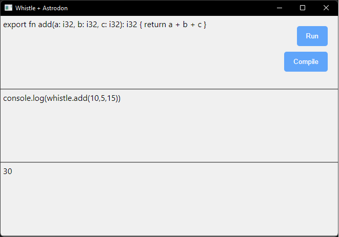

A simple Desktop compiler for [Whistle](https://github.com/whistle-lang/whistle) made using [🦕 Astrodon](https://github.com/astrodon/astrodon/tree/feature/deno_tauri) and [Deno](https://deno.land/).

**Note**: Astrodon is currently being developed, therefore, it is on alpha stage and it's missing some stuff. The version used on here is from Astrodon's `feature/deno_tauri` branch.



Install Astrodon's cli:

```shell
deno install -A --unstable -n astrodon https://raw.githubusercontent.com/astrodon/astrodon/feature/deno_tauri/modules/astrodon-cli/mod.ts
```

Run the app in development mode:

```
astrodon run
```

Build an executable:

```
astrodon build
```
